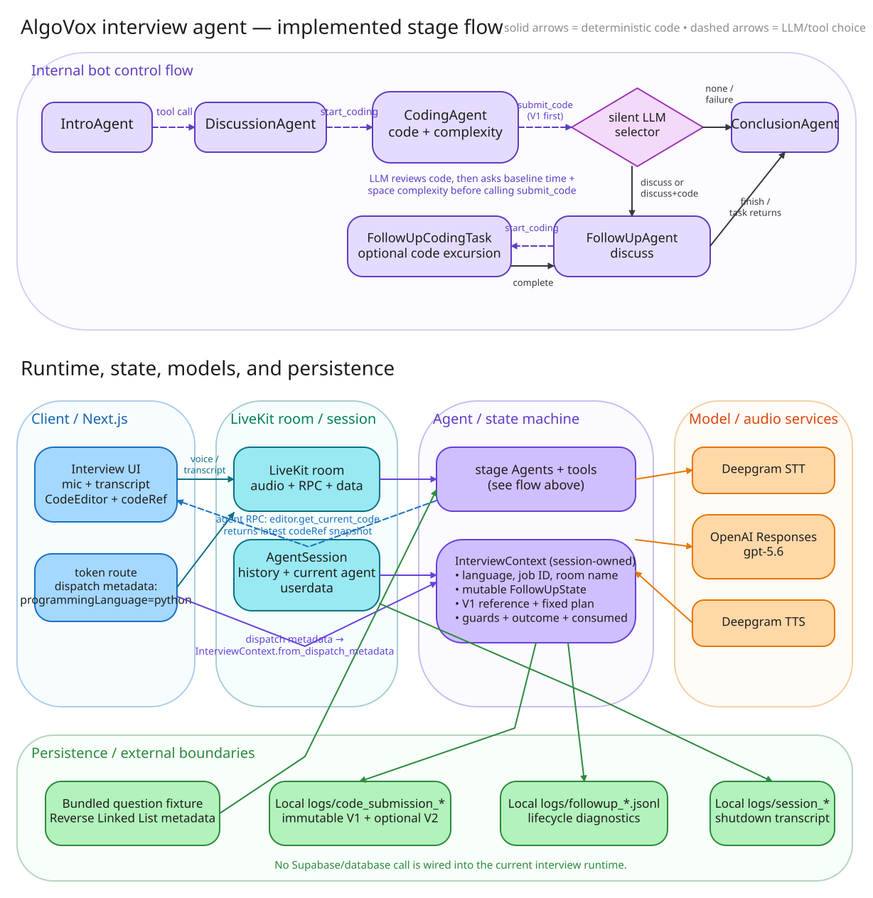

# AlgoVox interview-agent architecture

[Open the editable Excalidraw source](./agent-architecture.excalidraw) · [Open the SVG preview](./agent-architecture.svg)

The canvas contains two compact diagrams: the implemented internal stage flow, and the runtime boundaries around that flow.

## Major sections

1. **Internal bot control flow** — `IntroAgent` and `DiscussionAgent` hand off through LLM-selected function tools. `CodingAgent` owns implementation review and the baseline time/space complexity checkpoint. Its `submit_code` tool deterministically saves V1 before running the one silent follow-up selector. A valid assessment enters `FollowUpAgent`; `discuss_then_code` temporarily runs `FollowUpCodingTask` and returns to the same parent before conclusion.
2. **Client and LiveKit** — the Next.js interview UI joins a LiveKit room, publishes microphone audio, renders the transcript/audio, and owns the candidate editor's latest `codeRef`. `AgentSession` owns conversation history, the active agent, the voice pipeline, and `InterviewContext` as session userdata.
3. **State and metadata** — the token route writes `programmingLanguage: "python"` into agent-dispatch metadata. `InterviewContext.from_dispatch_metadata` adds that value plus LiveKit job/room IDs; its session-scoped `FollowUpState` holds the immutable primary submission reference, selected plan, transition guards, and final follow-up outcome. The active interview question is the bundled Reverse Linked List fixture, not a database lookup.
4. **Models and tools** — Deepgram Nova-3 performs STT, the OpenAI Responses model `gpt-5.6` drives agent speech and function-tool choices, and Deepgram Aura-2 performs TTS. The separate follow-up selector uses the same LLM factory over an isolated HTTP request with strict schema output. `get_current_code` and submission tools are LLM-invoked; guards, saves, branch routing after tool completion, task resumption, and shutdown are deterministic application logic.
5. **Persistence** — accepted code snapshots are exclusive local JSON files under repository-root `logs/` (V1 and optional V2). Follow-up lifecycle events are local JSONL files, and filtered spoken transcripts are written locally after shutdown. No Supabase or other database call is part of the implemented runtime flow.

## Source files inspected

- `docs/interview-flow.md`
- `server/src/agent.py`, `server/src/agent_session.py`, `server/src/interview_context.py`, `server/src/config/agent_session_config.py`, `server/src/audio.py`
- `server/src/agents/{intro,discussion,coding,coding_tools,followup,followup_coding,conclusion}.py` and the corresponding stage prompts
- `server/src/{followup,followup_selector,editor_code,code_submission,interview_question}.py` and `server/src/services/transcription_service.py`
- `web/app/api/token/route.ts`, `web/components/app/view-controller.tsx`, `web/components/agents-ui/blocks/agent-session-view-01/components/agent-session-block.tsx`, `web/components/agents-ui/agent-session-provider.tsx`, and `web/components/editor/{code-editor,editor-code-context}.ts[x]`

## Uncertainties and explicit limits

- The repository shows the token route hard-coding Python dispatch metadata. A separate production caller could construct different dispatch metadata, but no such caller is implemented here.
- The bundled fixture is loaded into every stage. `starter_code` exists in the question model, but this UI currently initializes its editor to an empty string rather than loading that field.
- The LLM judges code from editor snapshots but does not execute it. There is no automatic follow-up timer, curated follow-up catalog, cloud database persistence, or guaranteed final snapshot on abrupt disconnect.
